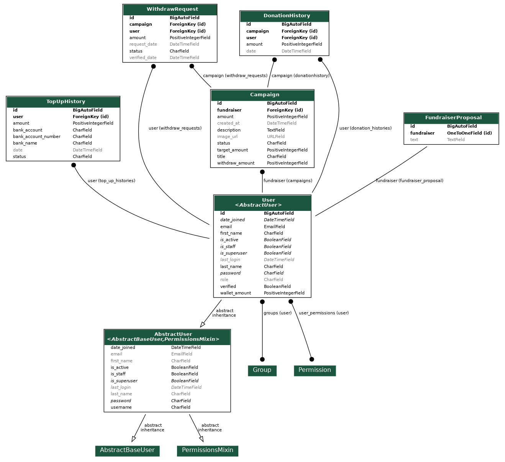
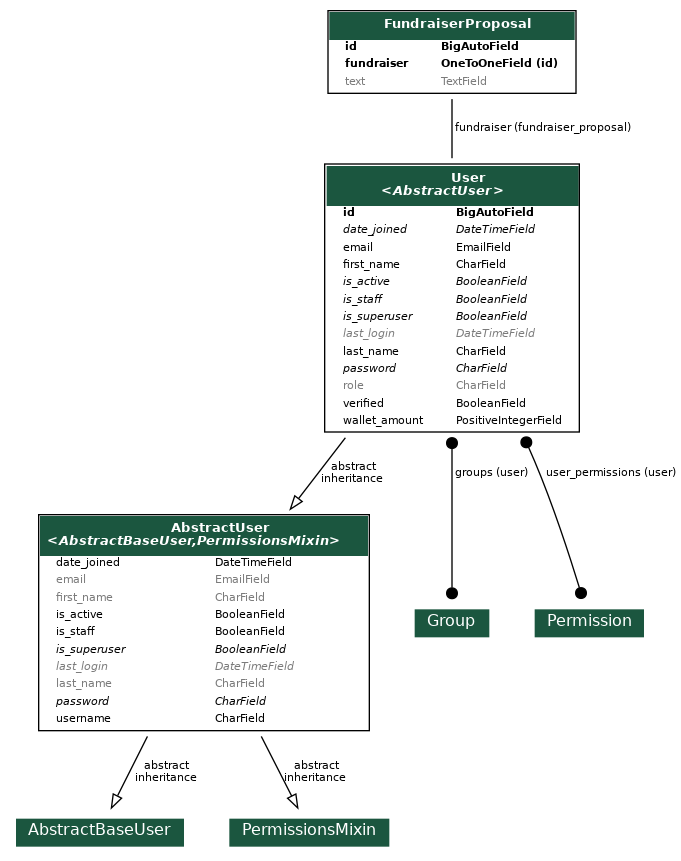
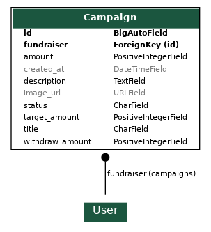
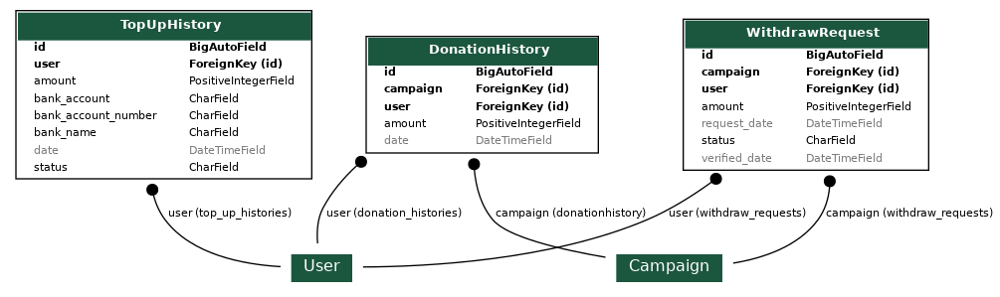

<div align="center" style="padding-bottom: 20px">
    <h1>Final Project Compfest Software Engineering Academy </h1>
    
    
    
    
</div>

## Motivation behind this project and features:

This project is built as a final project task for Software Engineering Academy Compfest XIII. I'm [Arsa](https://github.com/arsaizdihar) and [Ahmadhi](https://github.com/Recedivies) as a BackEnd division using Python and Django tech stack. [Galih](https://github.com/galihif) and [Novel](https://github.com/kucingapi) as a FrontEnd division using React JS tech stack.

## Description:

**Donation Platform** with CRUD operations to make a request. In order to retrieve/get/create/update/delete **JWT** is required. (Authorization: **Bearer** {token} attached to the headers). API provides endpoints for registration and token retrieval (access token and refresh token). With this access token, the user can access data related to the database through the API because the user is authenticated.

## Used Frameworks, libraries, tools, databases:

- Django + Django REST Framework + rest_framework_simplejwt

**Json Web Token Authentication** is possible thanks to 'rest_framework_simplejwt' package, which provides JWT implementation including DRF views for obtaining and refreshing tokens.

## Tools:

- Visual Studio Code, Postman

Production database is Heroku Postgres.
Locally we used default SQLite database.

## Database schema:

ERD diagram entities and manually created **Users**, **Campaign**, and **Wallet** entity.


### Users model:



### Campaign model:



### Wallet model:



Users has its own role field which can be admin, fundraiser, or donatur.

When registered as Fundraiser, he/she can `retrieve/get/create/delete` a verified campaign and need to make a proposal that should notify admin.

When registered as Donatur he/she can make a donate to particular campaign and also topup using e-wallet.

When registered as Admin, he/she can see list and **accept/reject** of fundraiser registration, a new of new donation program, a new withdrawal from donation program, and topup request from donatur.

All models are saved and updated using modified ModelSerializer. From serializers, Django REST can pass the data from `models.py` to the FrontEnd which is ReactJS via `urls.py`.

## Software Architecture:

Django in general has 2 architectures. The first one is MVC (Model-View-Template) and then other one is MVC (Model-View-Controller). Due to the FrontEnd is using library React JS instead of templates in "django-templates", we decide to choose MVC as a BackEnd Architecture.

The **Models** is logical data structure behind the entire application and is represented by a database.

The **View** is the user interface to see in the browser when visit a website. Because we don't use HTML/CSS/Vanilla JavaScript files, therefore the view represented by ReactJS files in FrontEnd.

The **Controller** is the middleman that connects the view and model together. We use `serializers.py` to passing data from model to the view (FrontEnd React JS).

## Testing:

All of API endpoints have their own unit tests. Every app in django application have their own `test.py` file.

##### `users` tests:

- Register and login as Admin, Fundraiser, and Donatur.
- Admin workflow.
- handle bug and error.

##### `campaign` tests:

- Get all campaign.
- Get verified campaign by donor.
- Get pending campaign by admin.
- Fundraiser create new donation program.
- Donor donation workflow.
- Donor e-wallet topup workflow.
- handle bug and error.

##### `wallet` tests:

- Fundraiser withdrawal workflow.
- TopUpHistory by Donatur.
- DonationHistory by Donatur.
- handle bug and error.

After Arsa and Ahmadhi made a unit test on every `test.py` file, finally we get **98% coverage test**.

## Deployment:

This repository has been deployed to Heroku. You can visit [here](https://donatur.herokuapp.com/)

### Step to reproduce deployment:

1. Create staticfiles folder.
   (Make sure you made an exception in .gitignore for this file.)
2. Make sure there is Procfile is root directory with these 2 lines:
   `release: python manage.py migrate`
   `web: gunicorn app.wsgi`
3. Set `DEBUG = False`, add `django_heroku.settings(locals())` on the bottom of settings.py.
   Make sure your **requirements.txt** contains every needed package. You may want to update it with
   `pip freeze > requirements.txt`.
4. Go to [Heroku](https://dashboard.heroku.com/) and add new app.
5. Go to Resources tab and install **Heroku Postgres** add-on.
6. Go to Settings tab and set **SECRET_KEY** in config vars. Add **heroku/python** buildpack.
7. Go to Deploy tab, connect your Github repository, select branch to deploy.
   You can Enable Automatic Deploys or Deploy Branch manually.
8. App should be up and running at `https://<name_of_app>.herokuapp.com`.

## Local Development:

git clone https://github.com/arsaizdihar/donatur-backend.git

### Django Setup

Create new virtual environment, activate it and install dependencies.

```shell script
pip3 -m venv venv

. venv/bin/activate

pip install -r requirements.txt
```

Set **SECRET_KEY** in your environmental variables.
You can also install `python-dotenv`, put `.env` file with secrets in root directory
and add those lines in settings.py. (Make sure .env is not being commited to git repository if you want to use this method)

```shell script
from dotenv import load_dotenv

load_dotenv()
```

Run migrations and create super user. (Making migrations might not be necessary)

```shell script
python manage.py makemigrations

python manage.py migrate

python manage.py createsuperuser
```

Run server and open your browser at `http://127.0.0.1:8000/`.

```shell script
python manage.py runserver
```

Run tests with coverage (unit tests + report)

```shell script
coverage run --include="./*" --omit="venv/*,manage.py,project_name/*" manage.py test

coverage report -m
```

You can make report from html coverage by default

```shell script
coverage run --include="./*" --omit="venv/*,manage.py,project_name/*" manage.py test

coverage html
```

Find index.html in htmlcov folder and open it to browser to see the tests and report
